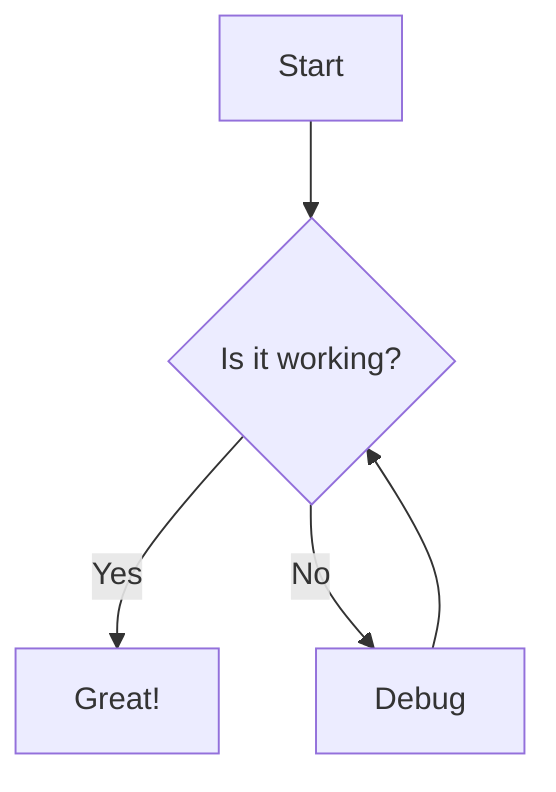
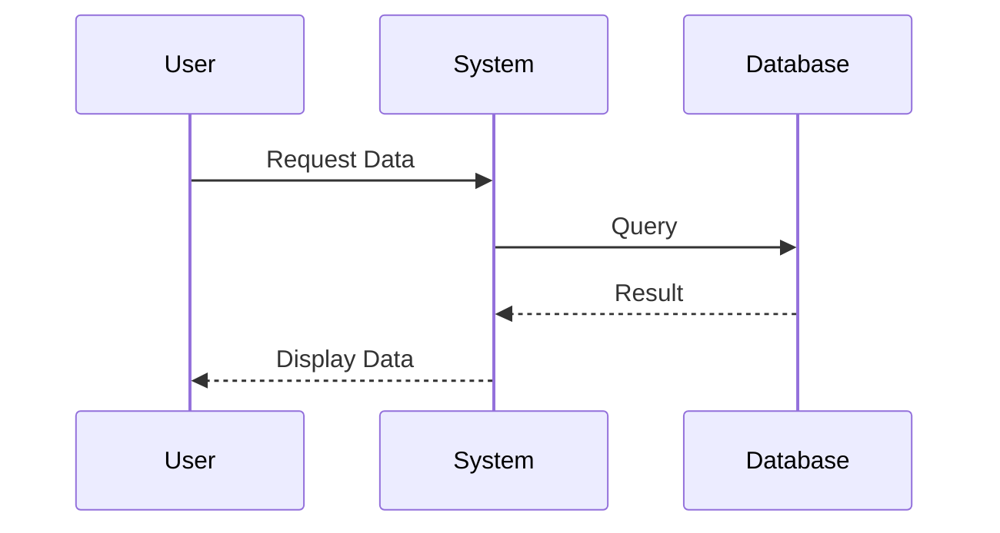
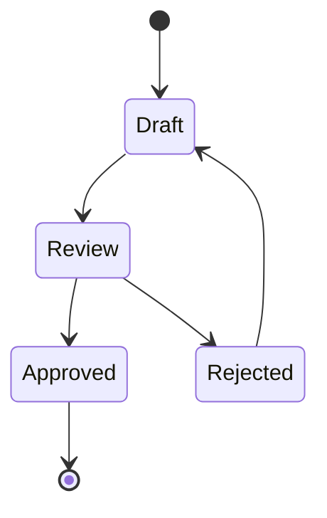
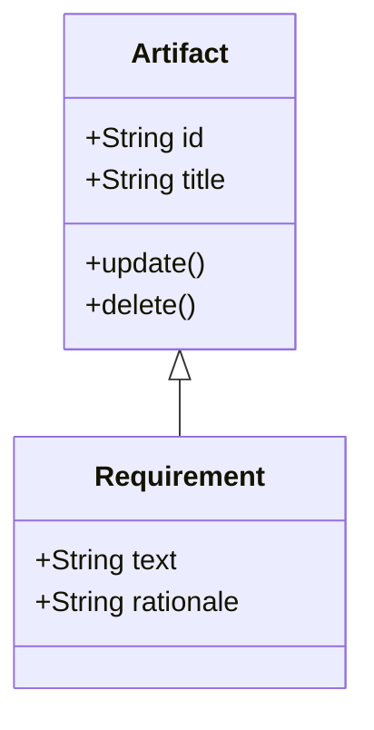
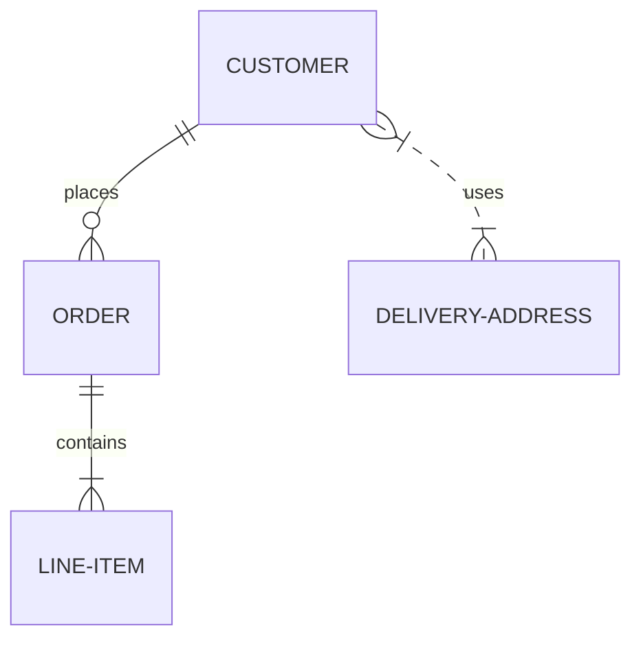

# Markdown & Mermaid Syntax Guide

This document illustrates how to write Markdown and Mermaid syntax, followed by how it is rendered in the Technical Registry.

---

## 1. Text Formatting

### Basics

**Syntax:**
```markdown
*Italic* using asterisks or _underscores_.
**Bold** using double asterisks or __double underscores__.
***Bold and Italic*** using triple asterisks.
~~Strikethrough~~ using double tildes.
```

**Rendered:**
*Italic* using asterisks or _underscores_.
**Bold** using double asterisks or __double underscores__.
***Bold and Italic*** using triple asterisks.
~~Strikethrough~~ using double tildes.

### Headings

**Syntax:**
```markdown
# Heading 1
## Heading 2
### Heading 3
#### Heading 4
```

**Rendered:**
# Heading 1
## Heading 2
### Heading 3
#### Heading 4

### Lists

**Syntax:**
```markdown
**Unordered List:**
- Item 1
- Item 2
  - Sub-item A
  - Sub-item B

**Ordered List:**
1. First item
2. Second item
   1. Nested item 1
   2. Nested item 2
```

**Rendered:**
**Unordered List:**
- Item 1
- Item 2
  - Sub-item A
  - Sub-item B

**Ordered List:**
1. First item
2. Second item
   1. Nested item 1
   2. Nested item 2

### Blockquotes

**Syntax:**
```markdown
> This is a blockquote.
> It can span multiple lines.
```

**Rendered:**
> This is a blockquote.
> It can span multiple lines.

---

## 2. Links and Images

**Syntax:**
```markdown
[Link to Google](https://www.google.com)


```

**Rendered:**
[Link to Google](https://www.google.com)

*(Image preview not available without a valid image path)*

---

## 3. Code Blocks

**Syntax:**
```markdown
Use `backticks` for inline code.

```python
def hello_world():
    print("Hello, world!")
```
```

**Rendered:**
Use `backticks` for inline code.

```python
def hello_world():
    print("Hello, world!")
```

---

## 4. Tables

**Syntax:**
```markdown
| Feature | Support | Notes |
| :--- | :---: | ---: |
| Markdown | Yes | Standard GFM |
| Mermaid | Yes | Diagrams |
| Tables | Yes | This is a table |
```

**Rendered:**
| Feature | Support | Notes |
| :--- | :---: | ---: |
| Markdown | Yes | Standard GFM |
| Mermaid | Yes | Diagrams |
| Tables | Yes | This is a table |

---

## 5. Mermaid Diagrams

To create a diagram, use a code block with the language identifier `mermaid`.

### Flowchart

**Syntax:**
````markdown

````

**Rendered:**


### Sequence Diagram

**Syntax:**
````markdown

````

**Rendered:**


### State Diagram

**Syntax:**
````markdown

````

**Rendered:**


### Class Diagram

**Syntax:**
````markdown

````

**Rendered:**


### Entity Relationship Diagram

**Syntax:**
````markdown

````

**Rendered:**

